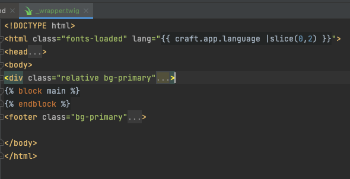

<h1>Real World Craft CMS</h1>

 - Dev Tip: Click CMS Profile button Preferences > Scroll to Development
    - Show Field Handles in Edit Forms

 

<h2>Setting up the Craft CMS Project</h2>

 - Get docker Desktop running
 - git clone git@github.com:YourAccount/your-repository-name.git
 - Project users 'make' commands to bundle up the various commands used to start, stop, and do other things in the project
   - start project localy by using 'make dev'
     - runs a series of commands, including 'docker-compose up'
   - Build 'dist' directory using the 'make build' command (which builds the project for production)
 - Site available at localhost:8888 and CMS Panel at localhost:8888/admin
 - Access to static assets
   - We’ll need to move over the 'images' inside of the images directory and move them to cms/web/img/site directory in our starter project. 
 - Testing the project
   - In the 'index.html' template, copy everything inside and including the 'body' tag, and then paste it in to the 'index.twig' in the starter project, replacing the 'body' section.
   - We’ll need to update some image paths to be 'img/site/' instead of the defaults in the static template.

 

<h2>Content Modeling the Homepage</h2>

- create an md file just like this and model the content ('trail-quest/content-model.md)

   

<h2>Creating a Single Section and Fields</h2>

- We implement our initial content model by creating a Single section for the site homepage.
- Demonstrates Strict Field layout that precicley matches template (One Field per content type)
- Settings > Sections > Create new section
  - Name* - Homepage
  - Handle* - homepage
  - Section Type - Single
  - Check the box with the home Icon in the single's 'site settings' 
  - Set Template - index.twig (cms > Templates > index.twig)
- Settings > Fields > New Group > 'Common' & 'Homepage'
  - New Field for Headline in Homepage group
    - Group* - Homepage
    - Name* - Headline
    - Handle* - headline
    - Field Type - Plain text
  - New Field for Tagline in Homepage group
    - Group* - Homepage
    - Name* - Tagline
    - Handle* - tagline
    - Field Type - Plain text
  - New Field in the Common group called "image"
    - Group* - Common
    - Name* - Image
    - Handle* - image
    - Field Type - Assets
    - Sources - Site only
    - Min Relations: 1
    - Max Relations: 1
- Settings > Sections > Homepage > Entry Types
  -add Headline Tagline and Image Fields to layout
  - Click on a Field's gear icon, here you can set label, instructions and set as required
- Entries > Singles > Homepage
  - Here we see all the new Field and labels we just created
  - Fill out the three with Image, Headline and Tagline and Save
     

<h2>Creating a Channel Section and Fields (Matrix & Content Builder)</h2>
- Creating a few standalone fields and then a Matrix Field to create a Content Builder to afford further customization of page layout
- Demonstrates Flexible Field Layout via using a Matrix Field to create a Content Builder
  - Each block of the Matrix Field would become one of the available content types.
- Settings > Sections > New Section - Adventures
  - Name* - Adventures
  - Handle* - adventures
  - Section Type - Channel
  - Set Entry URI Format - adventures/{slug}
  - Set Template - adventures/_entry (New File: cms > Templates > adventures > _entry.twig)
- Settings > Fields > Common > New Field
  - Group* - Common
  - Name* - Description
  - Handle* - description
  - Field Type - Plain Text
- Settings > Fields > Common > New Field
  - Group* - Common
  - Name* - Images
  - Handle* - images
  - Field Type - Assets
  - Min Relations: 1 
  - Max Relations: 4
- Install Redactor from plugin store via command line: 
  - make composer require craftcms/redactor && make craft plugin/install redactor
    - requires plugin as package in compose and installs it as plugin in craft
      - Settings > Plugins > (new) Redactor
- Settings > Fields > New Group > Adventures > New Field - Content Builder
  - Group* - Adventures
  - Name* - Content Builder
  - Field Type - Matrix
  - Configuration: (Block Types and Fields)
    - New Block Type: 
      - Name* - Rich Text | Handle* - richText
        - New Field
          - Name* - Text | Handle* - text | Field Type - Redactor (default config)
    - New Block Type:
      - Name* - CTA | Handle* - cta
        - New Field
          - Name* - Text | Handle* - text | Field Type - Plain Text
        - New Field
          - Name* - URL | Handle* - ctaUrl | Field Type - URL (web, telephone, & email)
    - New Block Type
      - Name* - Stats | Handle* - stats
        - New Field
          - Name* - Stat | Handle* - stat | Field Type - Table
            - ColumnHeading - Name | Handle - name | Type - single-line text
            - ColumnHeading - Value | Handle - value | Type - single-line text
            - Min Rows: 2
            - Max Rows: 4
            - Row Label: "Add a Stat"
- Settings > Sections > Adventures > Entry Types - Default
  - Create Adventures Field Layout
  
- Entries > Adventures > New Entry - Big Bend Bounce
  
  - Also add images and hit save
     

<h2>Creating About and FAQs Singles</h2>
- Make about.twig and faqs.twig in cms > templates
- Settings > Sections > New Section - About and FAQs (both Type: Single)
  - (Site Settings: URI - about | Template - about.twig | Section Type - single)
  - (Site Settings: URI - faqs | Template - faqs.twig | Section Type - single)
  - ... \> Entry Types
    - Note: each of these singles has only one Layout, with fields:
      - Label* - Title | Handle* - title | Required
      - Label* - About Page Copy | Handle* richText 
        - Settings > Fields > Common > New Field - Rich Text (redactor field)
          - Group* - Common | Label* - Rich Text | Handle* - richText | Field Type - redactor
          - Entries > Singles > FAQs
            
             

<h2>Preview Targets in Craft CMS</h2>
- In Craft CMS Pro edition, we have the option of using one or more preview targets. 
  - These are URLs to templates that content authors use to preview the content in the site designs and layouts.
  
 

<h2>Creating Categories and Field Layouts</h2>
 - Because "Adventures" are entries and each Adventure takes place at a Location: (Adventures - Channel Section)
   - cms > templates > locations > _category.twig & index.twig
   - Settings > Categories > New Category Group - Locations (Locations - Category Section)
     - Name* - Locations
     - Handle* - locations
     - Max Levels: 1 (don't allow nesting)
     - Site Settings: Category URI Format - locations/{slug} | Template - locations/_category.twig
     - Field Layout: 
       - Title*
       - Description
       - Horizontal Rule
       - Content Builder
       - Images
   - Categories > Locations > New Category
   
 - Settings > Fields > Adventures > New Field - Locations (Associates Adventure with Location Category)
   - Group* - Adventures
   - Name* - Location
   - Handle* - location
   - Field Type - Categories
   - Source - Locations
   - Label - Add a Location
- Modify Adventure Field Layout
  -  Settings > Sections > Adventures > Default Entry Type
    - Add Location to Default Field Layout
    

 

<h2>Coding a Single Section in Craft and Twig</h2>
- Homepage is a single, therefore, We get the entry data automatically via the 'entry' object (same for individual entry views)
- Since we already added mark up earlier we can add the title dynamically by replacing the title copy with 
  - {{ entry.title }} and add headline dynamically by replacing headline copy with {{ entry.headline }}
    - How to only allow four letters per line in the headline
       ~~~
       
       
          
              
                 {{ word }}
              
          
       
       ~~~
- Replacing Image 
  ``
    - .one gets only 1 img even if only one image available
    - .url gets public url to single image
- Next Iterate over Homepage's Adventures in adventures section on index.twig
     ~~~
     
     
        ---Code for adventure bit here--
      
     ~~~
- Iterating over Homepage's Location (categories)
     ~~~
     
     
        <ul>  
            
            <li class="pb-2">  
                <a class="hover:text-secondary text-black underline" href="{{ location.url }}">{{ location.title }}</a>  
            </li>  
           
        </ul>  
     
     ~~~
 

<h2>Creating and Extending a Layout in Twig</h2>

- cms > templates > _layouts (new) > _wrapper.twig (new)
  
    - Make index.twig extend '_layouts/_wrapper.twig'
      - 

 

<h2>Testimonials Channel Section</h2>
- Create and configure a channel section for testimonials
- Create Fields testimonial(Plain Text), Author & Location (Byline - Table)
- Add twig code to home page that outputs **Random** testimonials

- Settings > Fields > Testimonials (new group) > Testimonial Byline & Testimonial Copy Fields (create)
- Name* - Testimonial Copy | Handle* - testimonialCopy | Type - Plain Text
- Name* - Testimonial Byline | Handle* - testimonialByline | Type - Table
  - Table Columns: 
    - Col Heading - Full Name | Handle - fullName | Type - single-line text
    - Col Heading - Location | Handle - location | Type - single-line text
  - Min Rows: 1
  - Max Rows: 1
  

- Settings > Sections > Testimonials > Entry Types (Default) 
  - Uncheck "Show Title Field"
  - Title Format* - {testimonialByline\[0\].fullName}  
    - Shows the Authors Full name as the Entry Title

- Next display Random testimonials on cms > templates > index.twig 
  ~~~
    
    
    
    

      --- Code ---
        {{ testimonials.first().testimonalCopy }}
        {{ testimonials.first().testimonalByline[0].fullName }}
        {{ testimonials.first().testimonalByline[0].location }}
      --- Code ---
        {{ testimonials.last().testimonalCopy }}
        {{ testimonials.last().testimonalByline[0].fullName }}
        {{ testimonials.last().testimonalByline[0].location }}
      --- Code ---
    

  ~~~
 

<h2>Coding a Twig Entry Template</h2>
- adventures/_entry.twig
- Compose adventures Entry twig that uses a switch case to handle different block types within content builder matrix

~~~
{# Adventure Entry Template #}



    <main>
        

            

                

                

                    

                        <h1
                                class="mt-2 text-3xl leading-8 font-extrabold tracking-tight text-gray-900 sm:text-4xl"
                        >
                            {{ entry.title }}
                        </h1>
                    

                

                

                    {# Content #}
                    

                        

                            
{{ entry.description }}

                        

                        {# ----------------
                             MATRIX FIELD
                           ----------------
                        #}
                        
                            
                                
                                {# Stats #}
                                

                                    <dl class="grid grid-cols-2 gap-x-4 gap-y-8">
                                        
                                        

                                            <dt class="text-base font-medium text-gray-500">{{ stat.name }}</dt>
                                            <dd class="text-3xl font-extrabold tracking-tight text-gray-900">{{ stat.value }}</dd>
                                        

                                        
                                    </dl>
                                

                                {# End Stats #}
                                
                                {# CTA #}
                                

                                    <a href="{{ block.ctaUrl }}" class="text-base font-medium text-primary">{{ block.text  }}&rarr; </a>
                                

                                {# End CTA #}
                                
                                {# Rich Text Content #}
                                

                                    {{ block.text }}
                                

                                {# End Rich Text Content #}
                            
                        
                        {# ----------------
                           END MATRIX FIELD
                           ----------------
                        #}
                    

                    

                        

                            
                            
                            <figure class="mb-8">
                                

                                    
                                

                            </figure>
                            
                        

                    

                    {# End Content #}
~~~
 

<h2>Image Transforms & Eager Loading</h2>
- **EAGER LOADING** - Used to prevent "n+1 issues" that can occur when loading images during an element query and for-loop
  - Eager loading images *and their transforms* prevents this 
  - In Craft4, all eager-loaded elements are returned as collections instead of standard data arrays.
    - Because of this change, *we don't need to change code for how we access the data that is returned from an eagerly loaded element*
  - To do this, we use the "with" method to tell Craft to eager load any element handles we pass in.
    - In this case, our field handle is "images", so we'll pass it in square brackets and in single quotes
    ~~~
    _adventures-listing.twig
    
    ~~~
  - we can dump and die these results of the adventures query to see that we have an eagerly loaded element in the returned data
  - remember, Craft 4 supports accessing eagerly loaded elements via the .one method. our image tags remain the same
    ~~~
    _adventures-listing.twig
    
    ~~~
- **IMAGE TRANSFORMS** - "Natural Size" of images is often too large (w/h)
  - we can see our images *max size needed* by using our web inspector and viewport toggeler
  - Image Transform can be used to call the image at a specific size to increase performance
  - Settings > Asset Settings  > Image Transforms > New Image Transform - Adventures Listing
    - Name* - Adventures Listing
    - Handle* - adventuresListing
    - Mode: (Crop (checked), Fit, Stretch)
    - Width: 600
    - Height: 400
    - Calling the image transform in the page
      ~~~
      
      ~~~

- **EAGER LOADING WITH EAGER LOADED TRANSFORMS**
  ~~~
            
            
                
We don't currently have any adventures scheduled in {{ category.title }}

            
            
                <a href="{{ adventure.url }}" class="group">
                    

                        
                    

                    <h3 class="mt-4 text-lg font-bold text-gray-900">
                        {{ adventure.title }}
                    </h3>
                    

                        {{ adventure.description }}
                    

                </a>
            
            
  ~~~

 

<h2>Refactoring to Shared Templates</h2>
- Abstracting code out and inserting into a shared template that can then be *included* using twig includes
- cms > templates > _shared (new) > _adventures-listing.twig (new)
  - all adventures listing code moved from index into this new twig file.  
     ~~~
    _shared/_adventures-listing.twig
    
    

    

        

            <h2 class="text-4xl leading-8 font-extrabold text-primary">
                {{ title ?? 'Trail Running Adventures' }}
            </h2>
            

                Choose your own trail adventure from locations across North
                America. Lace up and breathe in the fresh air. Welcome outside
                with TrailQuest.
            

        

        

            
            
                
We don't currently have any adventures scheduled in {{ category.title }}

            
            
                <a href="{{ adventure.url }}" class="group">
                    

                        
                    

                    <h3 class="mt-4 text-lg font-bold text-gray-900">
                        {{ adventure.title }}
                    </h3>
                    

                        {{ adventure.description }}
                    

                </a>
            
            
        

    

    

     ~~~
- In templates > index.twig
     ~~~
     
     ~~~
- cms > templates > _shared (new) > _adventures-listing.twig (new)

 

<h2>Flexible Category Templates</h2>
- Demonstrate Craft's flexibility by building out our Location page
- cms > templates> locations > _category.twig 
  - Display information about the location, Adventures *located at the location*, and other locations *excluding the current location*
  - use code from adventures > _entry.twig and refactor
    - no longer have access to "entry." data we now use "category."
      - everything else is the same
~~~
locations/_category.twig




    <main>
        

            

                

                

                    

                        <h1
                                class="mt-2 text-3xl leading-8 font-extrabold tracking-tight text-gray-900 sm:text-4xl"
                        >
                            {{ category.title }}
                        </h1>
                    

                

                

                    {# Content #}
                    

                        

                            
{{ category.description }}

                        

                        {# ----------------
                             MATRIX FIELD
                           ----------------
                        #}
                        
                            
                            
                                {# Stats #}
                                

                                    <dl class="grid grid-cols-2 gap-x-4 gap-y-8">
                                        
                                            

                                                <dt class="text-base font-medium text-gray-500">{{ stat.name }}</dt>
                                                <dd class="text-3xl font-extrabold tracking-tight text-gray-900">{{ stat.value }}</dd>
                                            

                                        
                                    </dl>
                                

                                {# End Stats #}
                            
                                {# CTA #}
                                

                                    <a href="{{ block.ctaUrl }}" class="text-base font-medium text-primary">{{ block.text  }}&rarr; </a>
                                

                                {# End CTA #}
                            
                                {# Rich Text Content #}
                                

                                    {{ block.text }}
                                

                                {# End Rich Text Content #}
                            
                        
                        {# ----------------
                           END MATRIX FIELD
                           ----------------
                        #}
                    

                    

                        

                            
                            
                                <figure class="mb-8">
                                    

                                        
                                    

                                </figure>
                            
                        

                    

                

            

        

        
        
    </main>

~~~
- This solution above shows a good looking location page, however, it is showing *all* adventures and locations
  - Here is how to we make it flexible (*Showing adventures at that location, and all **other** locations* )
  ~~~
    Replace in code above
    
    
  ~~~
  - this code above uses 'with' to change the currentLocation or title
  - We must now also modify _shared/_adventures-listing and _shared/_locations to 'look for' supplemented titles
  ~~~
    _shared/_locations.twig
    <h2 class="text-4xl leading-8 font-extrabold text-primary">
      {{ title ?? 'Trail Running Adventures' }}  
    </h2>
    
    
    
        
We don't currently have any adventures scheduled in {{ category.title }}

    
    
      Rest of code
  ~~~
  ~~~
    _shared/_adventures-listing.twig
    SOME CODE
    
    
        <ul>
            
                <li class="pb-2">
                    <a class="hover:text-secondary text-black underline" href="{{ location.url }}">
                       {{ location.title }}
                    </a>
               </li>
            
        </ul>
    
    REST OF CODE
  ~~~
