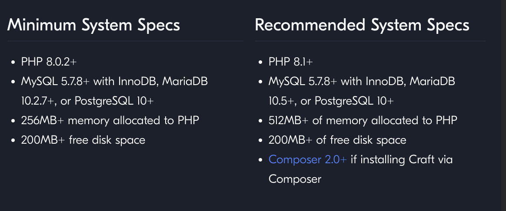
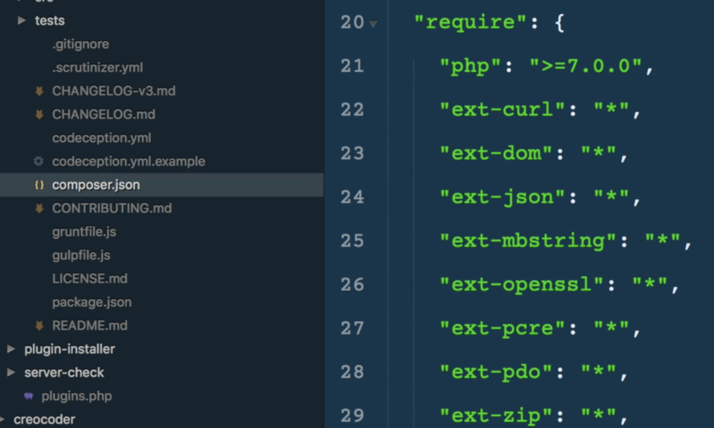
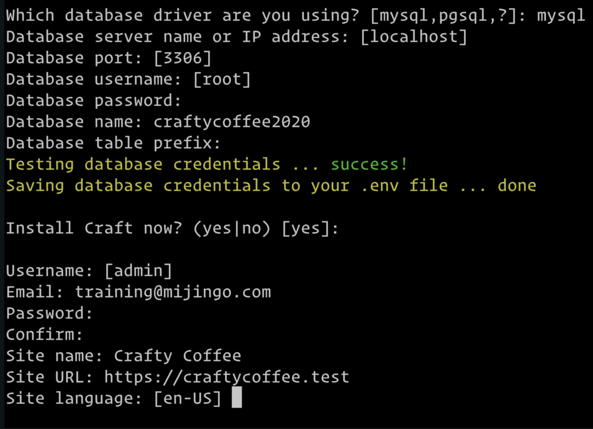

<h1>Up and Running with Craft CMS</h1>

 - Pre-Requried course for Twig Templates in Craft

<h2>Building the Craft Coffee Site</h2>

- How to install and configure Craft
- Become familiar with Craft Control Panel, files, and directories
- Convert Static HTML into Craft Templates using twig
- Plan and Create Content Sections, Fields, and Field Layouts
- Create Asset Sources, generate thumbnails automatically
- Learn Basics of Twig Templating and Twig Inheritance
- Assign and display categories
- Set up and use Matrix Field

<h2>Craft Installation - Minimum Requirements</h2>

- Check Documentation at <a href="https://craftcms.com/docs/4.x/requirements.html#minimum-system-specs" target="_blank">craftcms.com/docs/4.x/requirements.html#minimum-system-specs</a>
   
  - DB Requirements
    - MySQL and PostgreSQL
    - Database Credentials (including database Name)
    - Database user should have read/write permissions
  - Permissions
    - craft/config (writable)
    - craft/storage (writable)
    
<h2>What is Composer</h2>

 - Default installation option (offers many positives)
 - A dependency manager that handles all the software needed to run an app or project
 - You tell Composer what your projects need to run
   - Composer will install those dependencies for you
 - Composer handles dependencies for a project, it does not install packages globally
 - Helps you keep your dependencies separate from your project code. 
> - Define your project dependencies in a composer.json file
> - Use a "require" key, which takes an object with your dependencies, to bring them into project
>   

- Installation
  - Every project should have its own composer files, so that updates or changes to dependencies are isolated per project
  - <a href="https://getcomposer.org/">Download Composer</a>
  - drop each php command in one command/line at a time
  - move composer to /usr/local/bin/composer
  - 
<h2> **More on Local Hosting in Local-Hosting.md**</h2>

<h2>Installing Craft with Composer</h2>

- mkdir craftycoffee-2020
  - cd craftycoffee-2020
    - composer create-project craftcms/craft .
        - wait for craft dependancies to load in
    - then Set up craft from terminal
      - ./craft setup
      
        - What changed?
          - ls -al

<h2>Running Craft CMS Setup in the Browser</h2>

- .env file
  - environment file, specific to each environment (local, staging, production)
    - ex - DB connection info
  - is not shared via git repository
  - uses PHPDotEnv (based on Ruby's dotenv)
  - .env in project root
  - Anything you set is accessible globally via the $_ENV global, which you can retrieve via getenv('key')
  - Use your .gitignore file to ignore this file so it is not tracked in your repository
    - done automatically?
  - PHPDotEnv is a dependency for Craft CMS

              
        

